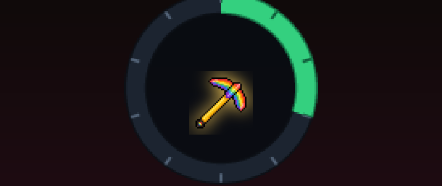

# Upgrader

> A CS2-style item upgrader: trade items for a chance at something more valuable.

Type `/upgrader`, put up to three item stacks into the slots, pick a more valuable target and spin the wheel. The green arc is your chance, the needle decides. No cheats needed - it works in a normal survival world.

## What it does

- Custom screen: your items on the left, a gauge with a green win arc and needle in the middle, the target on the right
- Chance = floor(100 x input value / target value x (1 - house edge)) percent, 5% house edge, capped at 95%
- **Provably fair timing**: the outcome is rolled and settled *before* the animation plays - inputs are removed and the prize is given in one step. Closing the screen, leaving or dying mid-spin cannot duplicate or lose anything
- A full inventory drops the prize at your feet instead of losing it
- Multiplayer-safe: every session is tracked per player
- A 24-item value pool from coal to a beacon, plus three exclusive high-value tools only obtainable this way

## Download

Grab **`Upgrader-v1.0.2.mcaddon`** from the [releases page](../../releases) or straight from this repository.

New to this? Follow **[SETUP-HELP.md](SETUP-HELP.md)** - it walks you through installing and starting it.

## Good to know

The interface is a custom screen built with JSON UI - Minecraft's own menu system reused for this. Everything is settled server-side the instant you press UPGRADE; the spin you see afterwards is just the reveal.

## Dev Book

Every pack of mine carries a small easter egg: craft the **Dev Book** with **9 logs** (any wood type, 3x3 in a crafting table) and right-click it. It opens like a book: page 1 the credits, page 2 what this mod is, page 3 the GitHub links (Minecraft cannot open links, so they are shown as text). It also sits in the creative inventory under *Equipment*.

## Notes

- Not an official Minecraft product. Not approved by or associated with Mojang or Microsoft.
- This does not involve real money or real-world value of any kind - it is an in-game item shuffle for fun.
- Not an official Minecraft product. Not approved by or associated with Mojang or Microsoft.

---

Made by **dev:#2444** - [github.com/hash2444](https://github.com/hash2444) - [upgrader](https://github.com/hash2444/upgrader)
